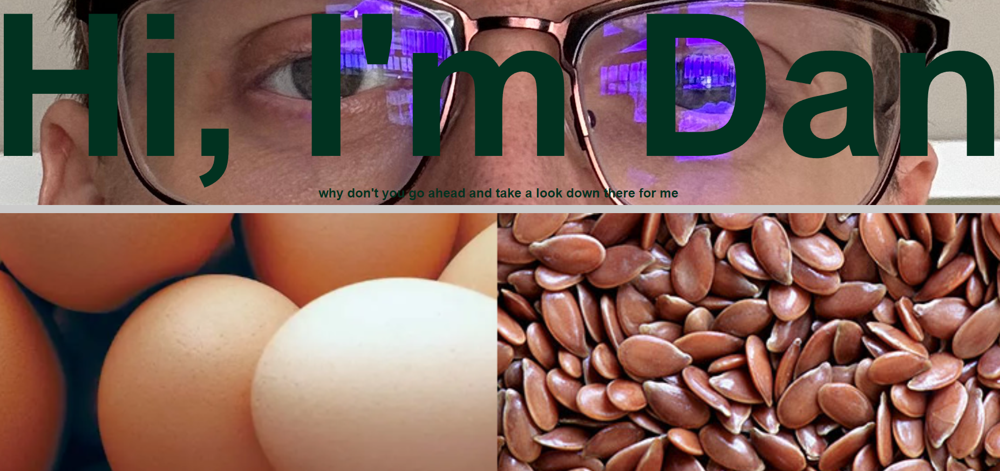

# Daniel O'Neil's Project Portfolio

## Personal Project Portfolio
This website contains info on all of my projects for a portfolio. There's only one hiccup, none of them are real. Yet.
I didn't have anything that I wanted to put in a portfolio, so for now it's populated with some ideas that are still in process, but the descriptions are written as if they are complete for realism.

I used HTML and CSS because those are the basic tools of building a website. I had a world of trouble figuring out where my margins and borders should go and getting text boxes that are on top of images to change their formatting when the images are hovered.

## Installation
This is simply a github pages website, you shouldn't have to install anything.

Here is a screenshot and a link for the project hosted on github.io
https://danpatoneil.github.io/Portfolio/

## Use
Once this project is complete, or at least more complete than it is right now, it will be a valuable resource for prospective collaborators or employers to look at for information on how capable a web developer I am.

MIT License

Copyright (c) [year] [fullname]

Permission is hereby granted, free of charge, to any person obtaining a copy
of this software and associated documentation files (the "Software"), to deal
in the Software without restriction, including without limitation the rights
to use, copy, modify, merge, publish, distribute, sublicense, and/or sell
copies of the Software, and to permit persons to whom the Software is
furnished to do so, subject to the following conditions:

The above copyright notice and this permission notice shall be included in all
copies or substantial portions of the Software.

THE SOFTWARE IS PROVIDED "AS IS", WITHOUT WARRANTY OF ANY KIND, EXPRESS OR
IMPLIED, INCLUDING BUT NOT LIMITED TO THE WARRANTIES OF MERCHANTABILITY,
FITNESS FOR A PARTICULAR PURPOSE AND NONINFRINGEMENT. IN NO EVENT SHALL THE
AUTHORS OR COPYRIGHT HOLDERS BE LIABLE FOR ANY CLAIM, DAMAGES OR OTHER
LIABILITY, WHETHER IN AN ACTION OF CONTRACT, TORT OR OTHERWISE, ARISING FROM,
OUT OF OR IN CONNECTION WITH THE SOFTWARE OR THE USE OR OTHER DEALINGS IN THE
SOFTWARE.